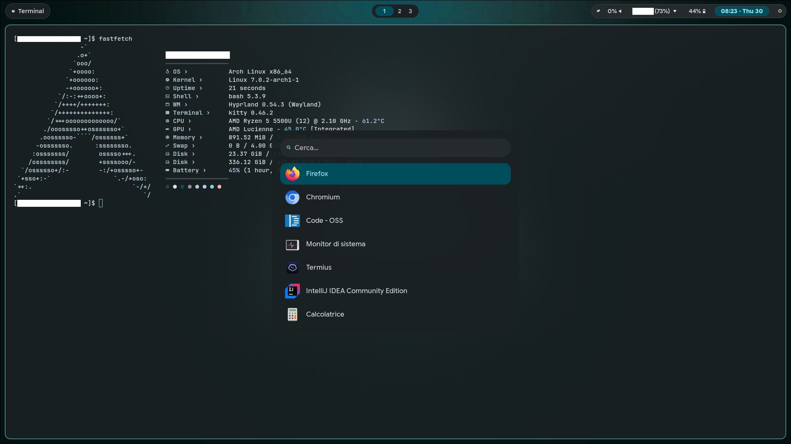

# Dotto's dotfiles
This repository contains my personal dotfiles for Hyprland, Waybar, Kitty, Rofi & (possibly) more.
These files are provided AS-IS and you are free to do pretty much whatever you want with them.

## What's included
This repository includes my current wallpaper, a simple script to display brightness level updates via dunst notifications, a few configuration files for various things (e.g Electron), all the configuration files for stuff I'm using and a bash script that install some of the packages I use (designed to just get a new machine up and running quickly).

## Issues & pull requests
Both issues and pull requests are disabled on this repository: the main reason is the fact that I'm using those files on a daily basis and I'm planning on updating them occasionally based on how i feel.
You are, of course, free to fork this repository and make your own changes!

## Screenshot


## License
```MIT License
Copyright (c) 2026 DottoXD

Permission is hereby granted, free of charge, to any person obtaining a copy
of this software and associated documentation files (the "Software"), to deal
in the Software without restriction, including without limitation the rights
to use, copy, modify, merge, publish, distribute, sublicense, and/or sell
copies of the Software, and to permit persons to whom the Software is
furnished to do so, subject to the following conditions:

The above copyright notice and this permission notice shall be included in all
copies or substantial portions of the Software.

THE SOFTWARE IS PROVIDED "AS IS", WITHOUT WARRANTY OF ANY KIND, EXPRESS OR
IMPLIED, INCLUDING BUT NOT LIMITED TO THE WARRANTIES OF MERCHANTABILITY,
FITNESS FOR A PARTICULAR PURPOSE AND NONINFRINGEMENT. IN NO EVENT SHALL THE
AUTHORS OR COPYRIGHT HOLDERS BE LIABLE FOR ANY CLAIM, DAMAGES OR OTHER
LIABILITY, WHETHER IN AN ACTION OF CONTRACT, TORT OR OTHERWISE, ARISING FROM,
OUT OF OR IN CONNECTION WITH THE SOFTWARE OR THE USE OR OTHER DEALINGS IN THE
SOFTWARE.
```
